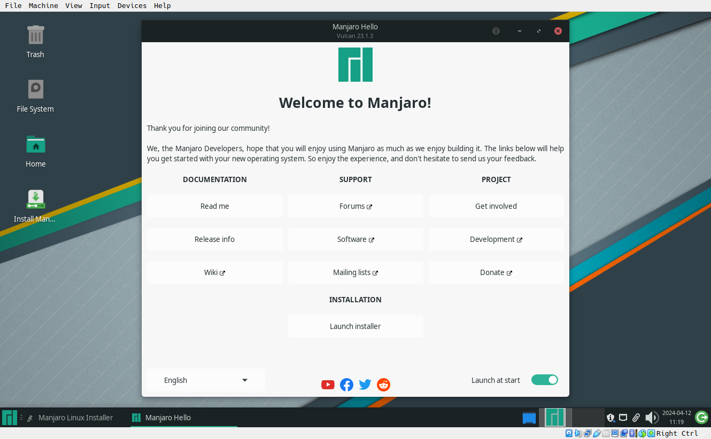
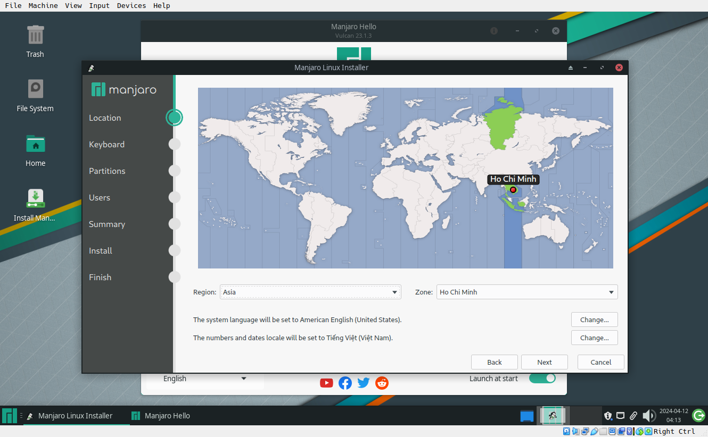
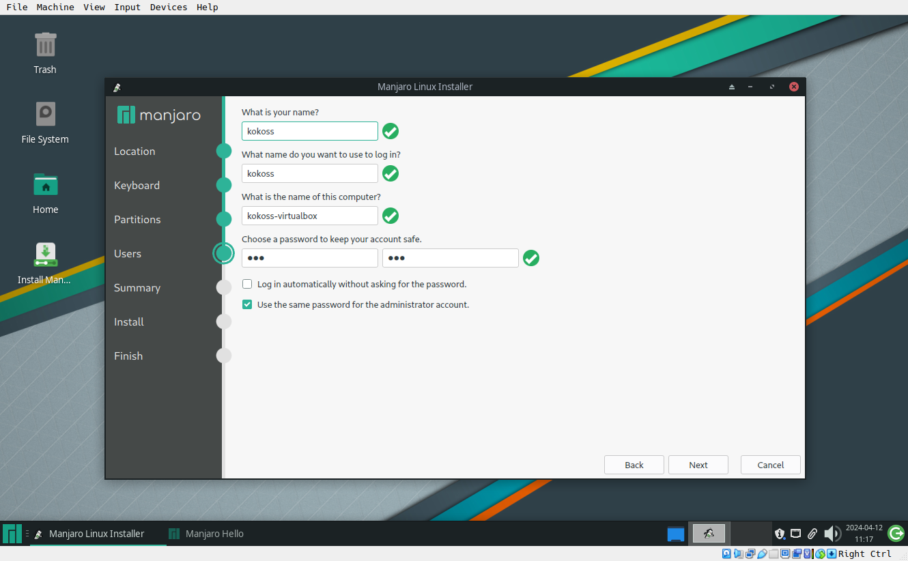

# Hướng dẫn cài linux qua Netboot.xyz ( cho người mới bắt đầu )


### Hướng dẫn cài hệ điều hành qua mạng (áp dụng cho linux :v)

#### Chuẩn bị:
#####  Máy chủ
- Docker ( ưu tiên linux :v )
- [dhcp-netboot.xyz](https://github.com/samdbmg/dhcp-netboot.xyz): docker [netboot.xyz](https://netboot.xyz) sử dụng qua DHCP

##### Máy khách
- có hỗ trợ Pxe/Network boot 
- kết nối chúng mạng với máy chủ
- có RAM ít nhất 8GB (vì netboot sẽ đưa hệ điều hành vào RAM :V)

#### Cài đặt: 

##### Máy chủ
- Sử dụng ufw để mở tưởng lửa các port như sau :
```bash
sudo ufw allow proto udp from any to any port 67
sudo ufw allow proto udp from any to any port 69
sudo ufw allow proto udp from any to any port 4011
sudo ufw allow proto tcp from any to any port 80
```
- Sử dụng lệnh docker để chạy máy ảo 
```bash
docker run --net=host --cap-add=NET_ADMIN -e DHCP_RANGE_START=192.168.0.1 samdbmg/dhcp-netboot.xyz
``` 
*ở phần DHCP_RANGE_START là 3 dãy số đầu của `ip a ` xxx.xxx.xxx.1* (vd 192.168.1.1)

##### Máy khách
- Kết nối chung mạng với máy chủ 
- Khởi động máy và boot vào chế độ Pxe/Network Boot 
 
- Trong hướng dẫn này sẽ cài Manjaro Gnome, ở Menu netboot chọn Live CD - Manjaro - Manjaro Stable - Manjaro Xfce ( Nếu báo lỗi chỉ cần chọn lại tầm 2-3 lần là được)
 
- đợi vài phút cho đến khi Majaro khởi động thành công 
 
- Chọn Lauch Installer 
 
- Ở location - Region : Asia - Zone: Ho Chi Minh
 
- Keyboard để mặc định - Next 
- partitions 
  - chọn Manual partitioning 
  - New Parrition Table - Chọn GPT 
  - Tạo lần lượt 3 phân vùng
    - phân vùng EFI ( khởi động hệ điều hành ),File Type: unformated, Size: 500Mb, ở flag tick vào boot-grub
    - Phân vùng swap ( RAM trên ổ cứng ), File Type: LinuxSwap, Size: 512Mb~5% tổng dung lượng ổ cứng  ( tùy vào nhu cầu sử dụng và bộ nhớ cho phép )
    - Phân vùng hệ điều hành ( chứa dữ liệu hệ điều hành và toàn bộ dữ liệu người dùng ), File Type: ext4,Mount Point: / , size: toàn bộ dung lượng còn lại của ổ cứng
     
- Ở user - đặt tên máy tính , tên người dùng và mật khẩu 
 
- ở summary - Install - Install Now sau đó chờ cài đặt  
 
- sau khi cài đặt xong, khởi động lại
 

##### Cài bộ gõ và công cụ văn phòng 
- Bộ gõ tiếng việt (fcitx5)
  - Mở Terminal Emulator
  - chạy lệnh sau với quyền admin (sudo), nhập mật khẩu và chờ cài đặt
  ```bash
  sudo pacman -Sy --noconfirm fcitx5 fcitx5-gtk fcitx5-configtool fcitx5-unikey
  ```
  - Khi cài đặt xong , khởi động fcitx5 trong start menu 
  - khi đó góc dưới bên phải màn hình sẽ xuất hiện icon bàn phím, ấn chuột phải và chọn `Configure` 
   
  - Ở `Search Input Method` , tìm unikey, Double-click để thêm , ẩn Ok
  - ***tùy chọn: ở Global Option, ở phần Trigger Input Method: có thể thêm phím hoặc sửa các phím ở bên phải để tùy chỉnh phím thay đổi kiểu gõ***
  <details>
    <summary>sau khi thêm unikey, có thể dùng lệnh này để thêm `Ctrl + Shift` vào phím thay đổi kiểu gõ</summary>

  ```bash
      sed -i -e '/^0=/d' -e 's/\(\[Hotkey\/TriggerKeys\]\)/\1\n0=Control+Shift+Shift_L/' ~/.config/fcitx5/config
  ```
  </details>

  - Cuối cùng chạy lệnh này để tối ưu bộ gõ của hệ thống
  ```bash
  echo "export GTK_IM_MODULE=fcitx
  export QT_IM_MODULE=fcitx
  export XMODIFIERS=@im=fcitx" >> .bashrc
  ```
- Trình duyệt và ứng dụng văn phòng ( libre office )
  - Chạy lệnh sau dưới quyền admin (sudo), nhập mật khẩu và chờ cài đặt
  ```bash
  sudo pacman -Sy --noconfirm firefox libreoffice-frech
  ```

#### Những công cụ sao lưu và khôi phục dữ liệu 
  
  - [Deja Dup](https://apps.gnome.org/DejaDup) 
  - [Back In Time](https://github.com/bit-team/backintime) 
  - [Time Shift](https://github.com/teejee2008/timeshift) 
