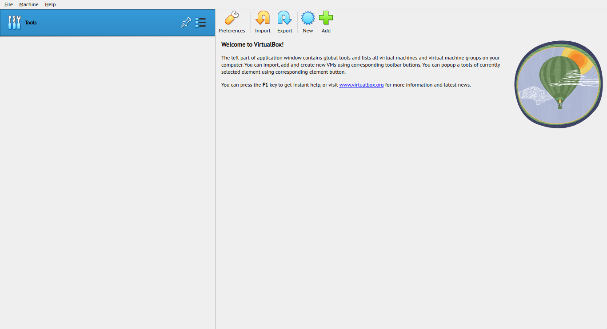
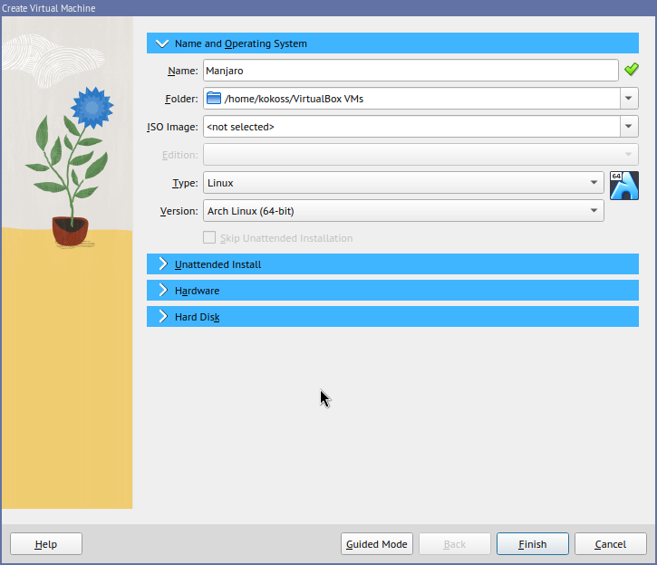
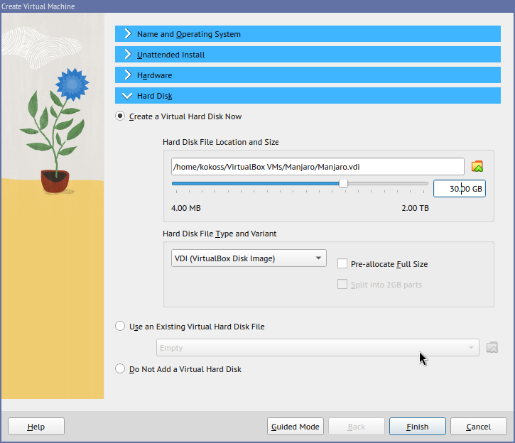
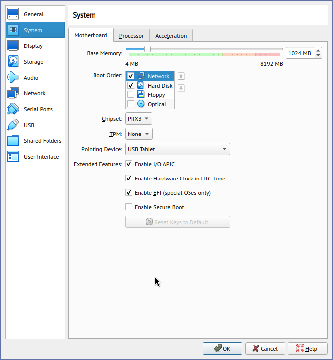
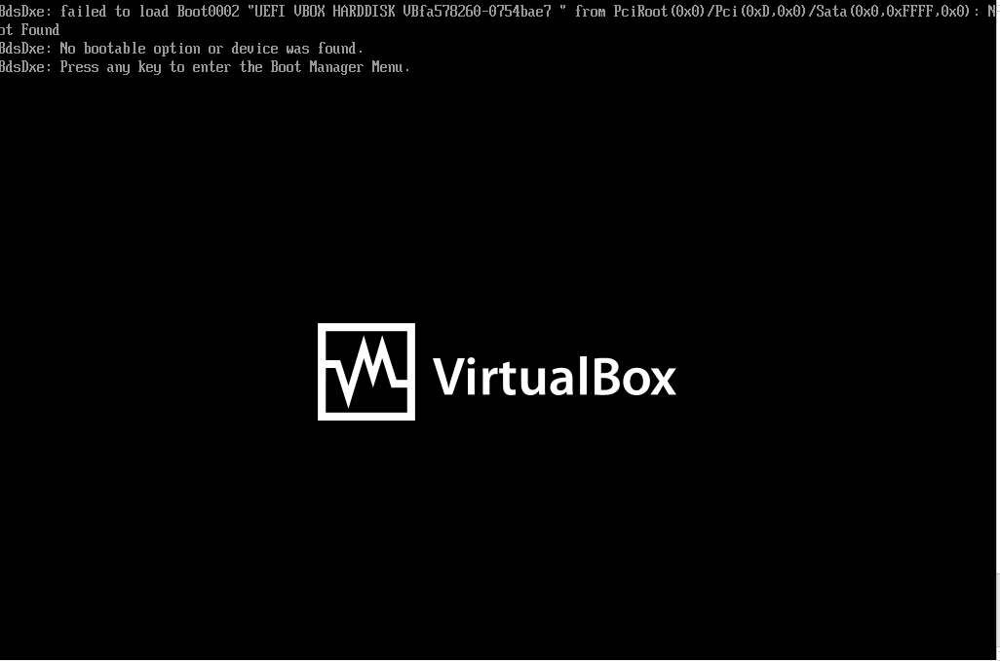
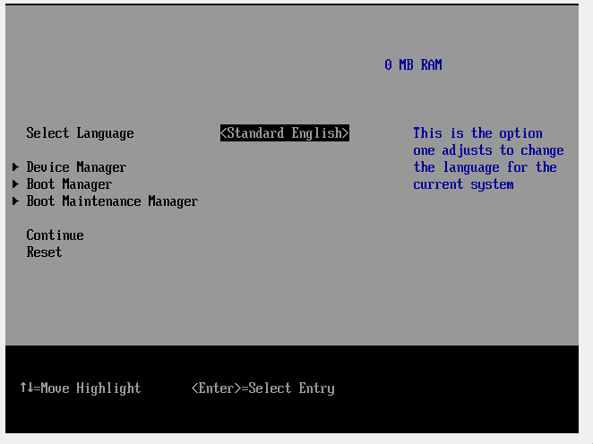
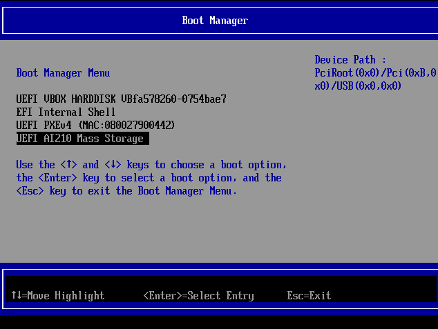
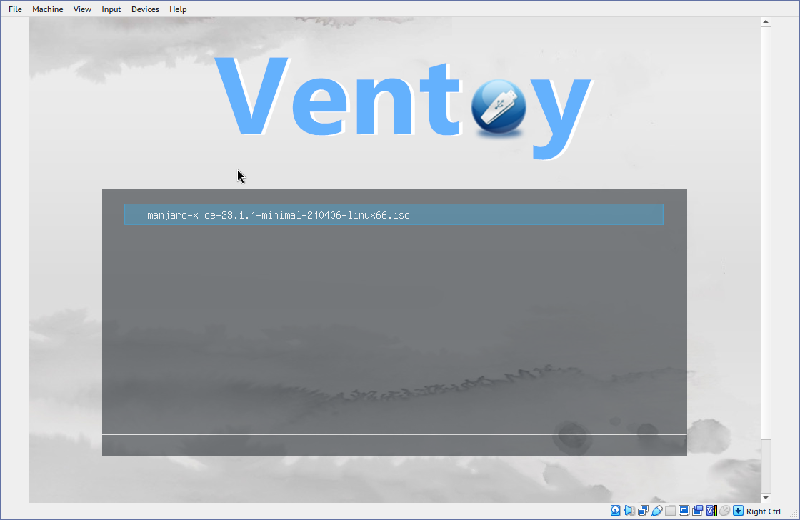

# Hướng dẫn cài đặt máy ảo với Oracle Virtual Box

## Chuẩn bị 

- Máy tính cá nhân (hoặc ra net cũng được)
- tối thiểu 2GB RAM (Khuyên dùng 8GB RAM)

## Cài đặt

- Tải từ [trang chủ virtualbox](https://www.virtualbox.org/wiki/Downloads) và cài đặt
  - VirtualBox platform packages (Chọn hệ điều hành phù hợp)
  - VirtualBox Extension Pack (Chọn `All supported platforms`)

- Sau khi cài đặt thành công VirtualBox, Khởi chạy virtual box 

 

- Chọn new để tạo máy ảo, sau đó đặt các tùy chọn như hình dưới (đặt tên tùy ý)

- Sau khi `Finish`, chọn `Settings`,chọn tab `System` và làm theo ảnh

- để boot vào USB, trước hết ấn `Start`, cancel tất cả các cửa sổ hiện ra và khi màn hình này xuất hiện

 
- ấn bất kỳ để vào BIOS

 
- sau đó ấn `Ctrl bên phải` thoát điều khiển máy ảo, ở trên Menu bar chọn `Devices > USB > [chọn usb cài đặt hệ điều hành]`.Sau đó click vào màn BIOS để điều khiển máy ảo, chọn Boot Manager (ở ví dụ này USB cài đặt là AI210 Mass Storage)

 

- Sau khi màn hình chạy như vậy là thành công,chọn file manjaro và [quay lại hướng dẫn cài đặt manjaro](../README.md) 

 

### Lưu ý 
tất cả lỗi trong lúc cài đặt có thể hỏi qua phần issue của github hoặc lên google hỏi 🐧
