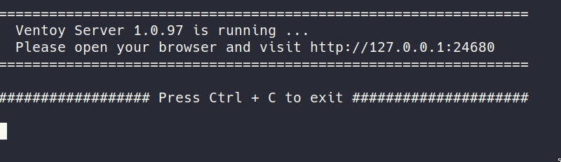
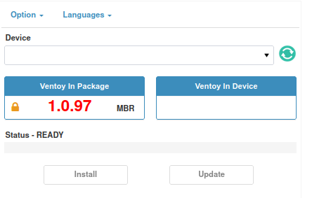
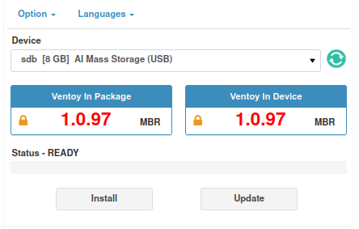
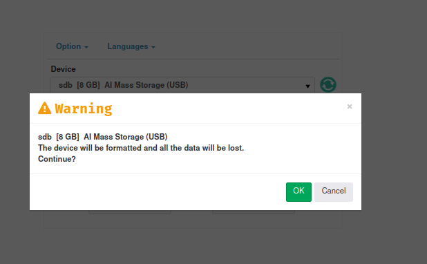
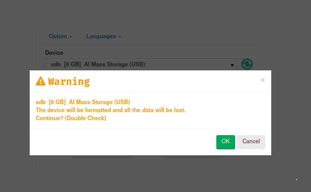
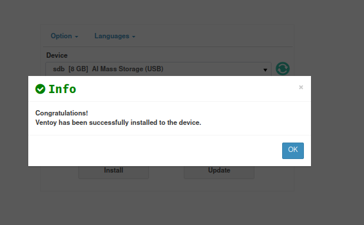
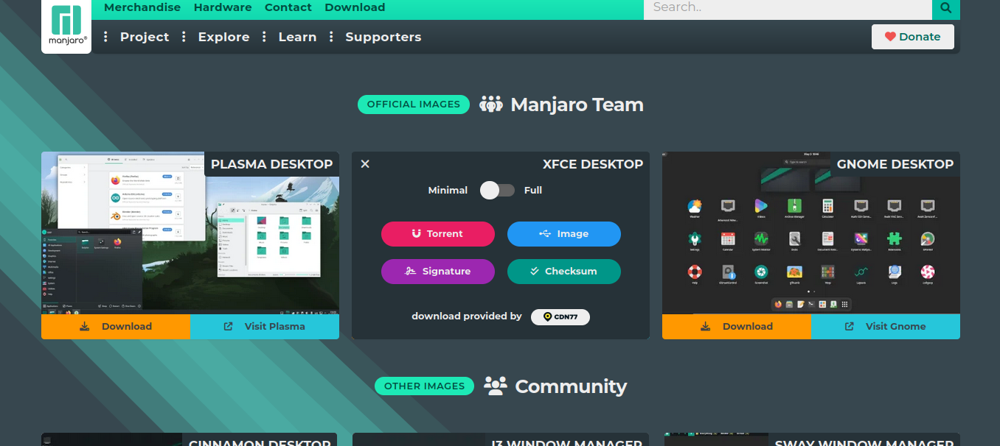
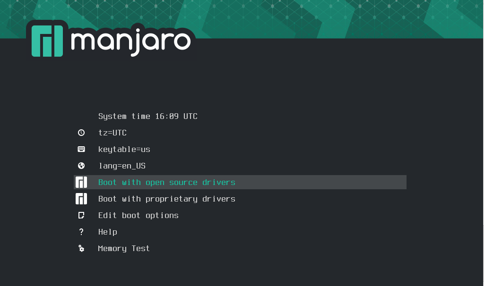

# Hướng dẫn tạo USB cài đặt Manjaro với Ventoy


### Chuẩn bị 

- USB (> 4GB)
- Máy tính (hoặc ra quán net làm cũng được)


### Cài đặt 

#### Ventoy 


- Tài Ventoy từ [trang chủ](https://ventoy.net/en/download.html) hoặc [SourceForge](https://sourceforge.net/projects/ventoy/files/v1.0.97)
- Với Windows, hãy chọn bản Windows. Với linux, hãy chọn bản Linux 🐧.

- Sau khi tải và giải nén Ventoy 
  - Với linux :
    - Khởi chạy file `VentoyWeb.sh`  với `sudo` 
    ```bash
    sudo ./VentoyWeb.sh
    ```
    
    
    
    
    - Chọn usb ở phần device và cài đặt (Nếu không có usb hãy ấn vào nút nhỏ bên cạnh device để làm mới)
  
    

    - Lưu tất cả dữ liệu quan trọng trước khi cài đặt ventoy vào usb
    
    
    

    - Đợi cho đến khi cài cài đặt thành công
    
    

  - Với windows : chưa dùng nhưng chạy file Ventoy2Disk.exe và làm tương tự như trên (maybe)

#### Manjaro

- Tải Majaro từ [Trang chủ](https://manjaro.org/download)(Chọn X86-64)

- Ở ví dụ này, phiên bản manjaro sử dụng là Xfce Desktop Minimal, Chọn Image để tải file ISO về máy


- Sau Khi tải xong, sao chép tệp tin ISO của manjaro (không yêu cầu giải nén) và đưa vào phân vùng Ventoy của USB
  - Với linux, sử dụng `thunar`  hoặc `nautilus` và mount phân vùng ventoy (không phải VTOYEFI) vào máy tính, sau đó sao chép ISO của manjaro vừa tải vào phân vùng ventoy
  - với windows, sao chép file ISO của Manjaro (không yêu cầu giải nén)  vào phân vùng ventoy (không phải VTOYEFI)

- Sau khi sao chép, usb cài đặt Manjaro đã sẵn sàng. Ngoài ra có thể đưa nhiều file iso vào để sử dụng cho nhiều mục đích khác nhau


### Lưu ý
- Trước khi boot vào ventoy, hãy tắt tính năng secure boot trên BIOS 
 
- Khi vào được màn hình trên, hãy chọn file ISO của manjaro (manjaro-xfce-...-minimal-....iso)

- ở màn hình menu này 
    - Nếu sử dụng card đồ họa rời của NVIDIA, chọn `Boot with  proprietary drivers` 
    - Còn lại, chọn `Boot with open source drivers` 
    - hoặc cứ chọn 1 trong 2 nếu gặp vấn đề giật lag thì chọn cái còn lại.
    - sau đó quay lại [bước cài dặt manjaro](../README.md) 

