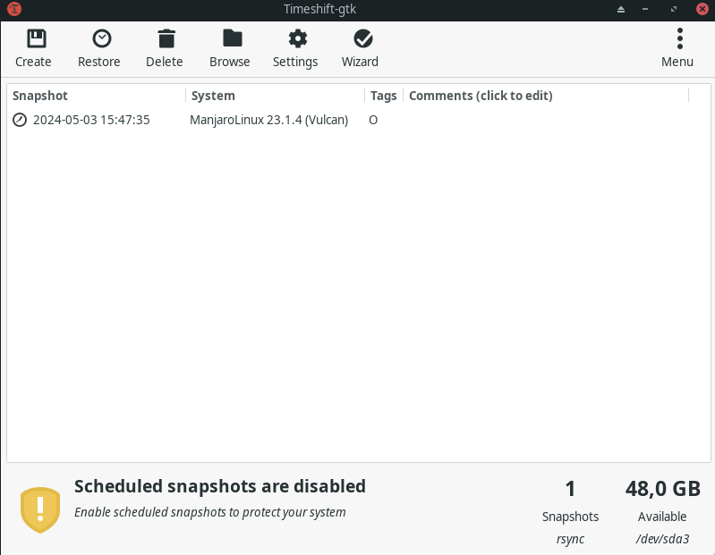
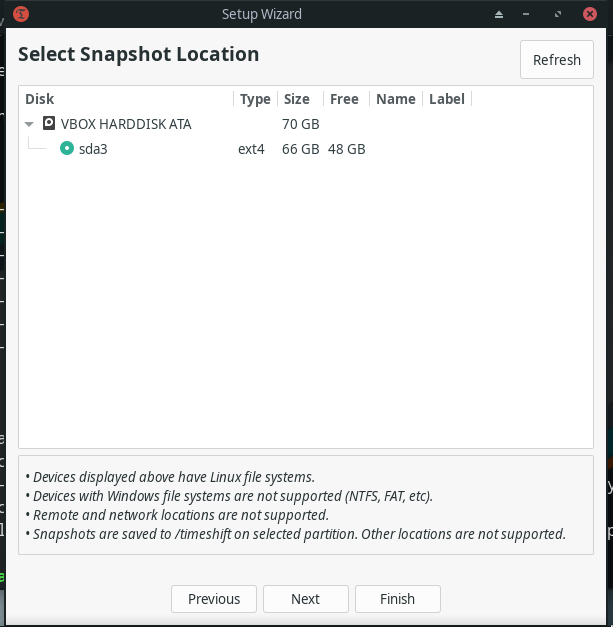
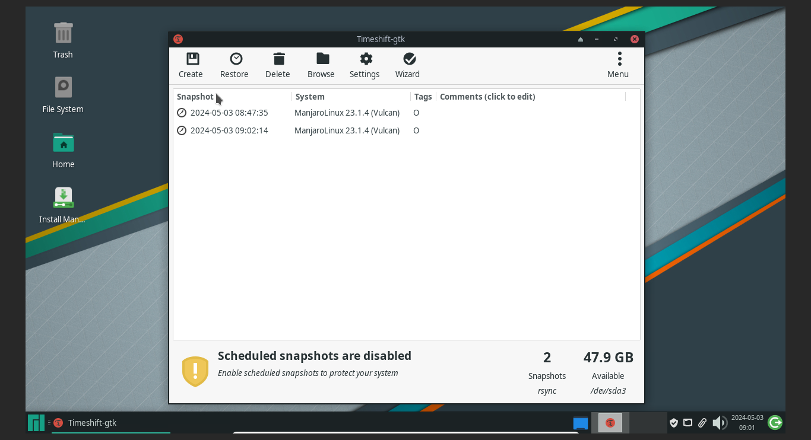
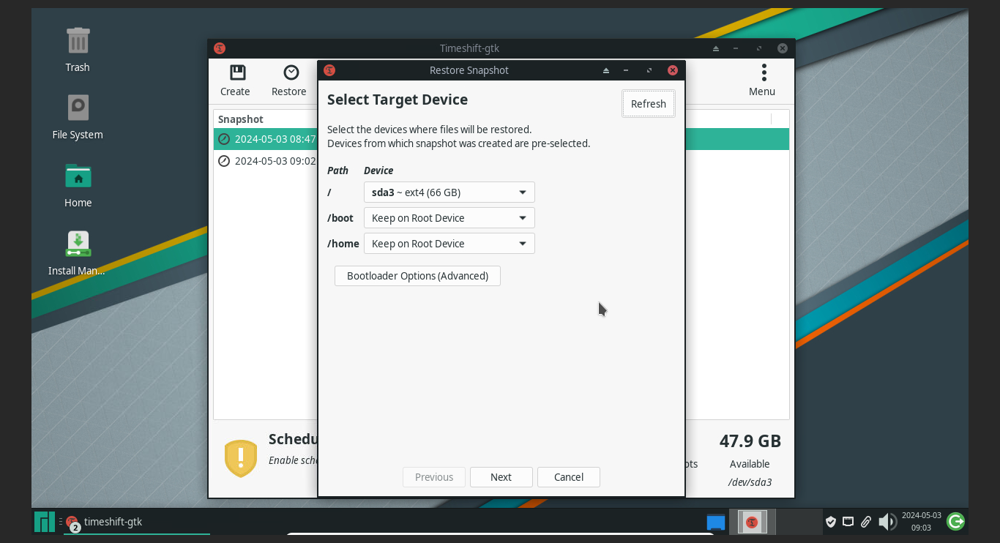
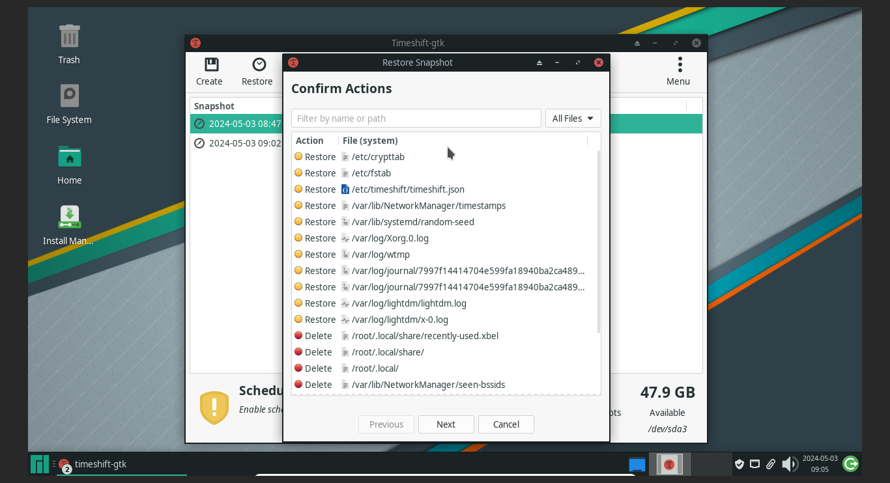
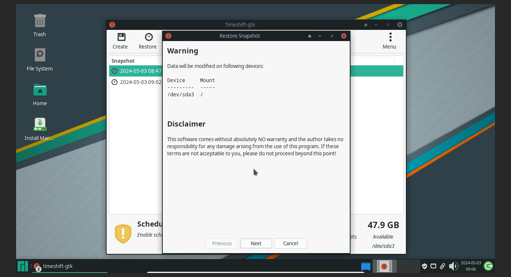
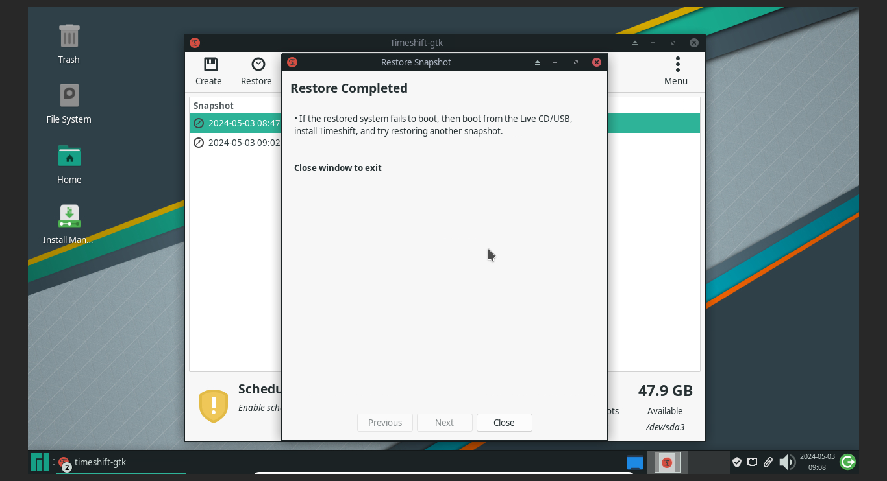

# Hướng dẫn sử dụng timeshift


## cài đặt time shift trên manjaro

cài đặt vào hệ điều hành
```bash
  sudo pacman -Sy timeshift
```


sau đó chạy timeshift ở startmenu ( Lần đầu khởi chạy sẽ hỏi 1 số thứ,cứ next cho đến khi thấy menu dưới)

 

## Sao lưu 

trong giao diện timeshift, chọn `Create`  để tạo snapshot, snapshot sẽ lưu vào phân vùng hệ thống


## khôi phục

trong trường hợp máy tính không thế vào hệ điều hành, sử dụng usb hoặc netboot để khởi động vào bộ cài đặt hệ điều hành Manjaro


Trong chạy timeshift ở manjaro, chọn phần vùng ổ cứng hệ điều hành

 

sau khi chọn máy tính sẽ quét các dữ liệu snapshot đã tạo

 

chọn snapshot và chọn restore, chọn next trong phần target device

 


sau khi kiểm tra sẽ yêu cầu xác nhận, ấn next để bắt đầu khôi phục

 

cảnh bảo thay đổi dữ liệu phân vùng, ấn next 


 


sau đó khởi động lại vào hệ điều hành và sử dụng 


 

### Lưu ý 
Gặp lỗi các bước có thể hỏi trong phần issue hoặc lên google hỏi 🐧


